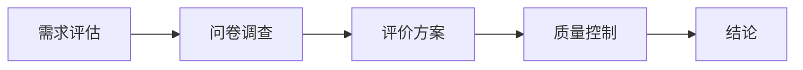
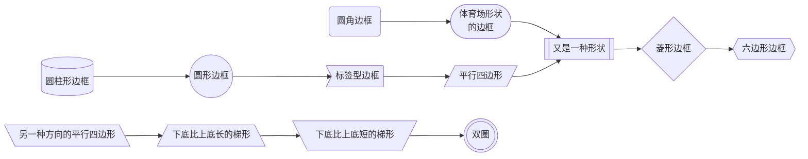
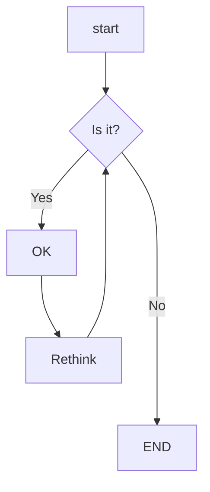
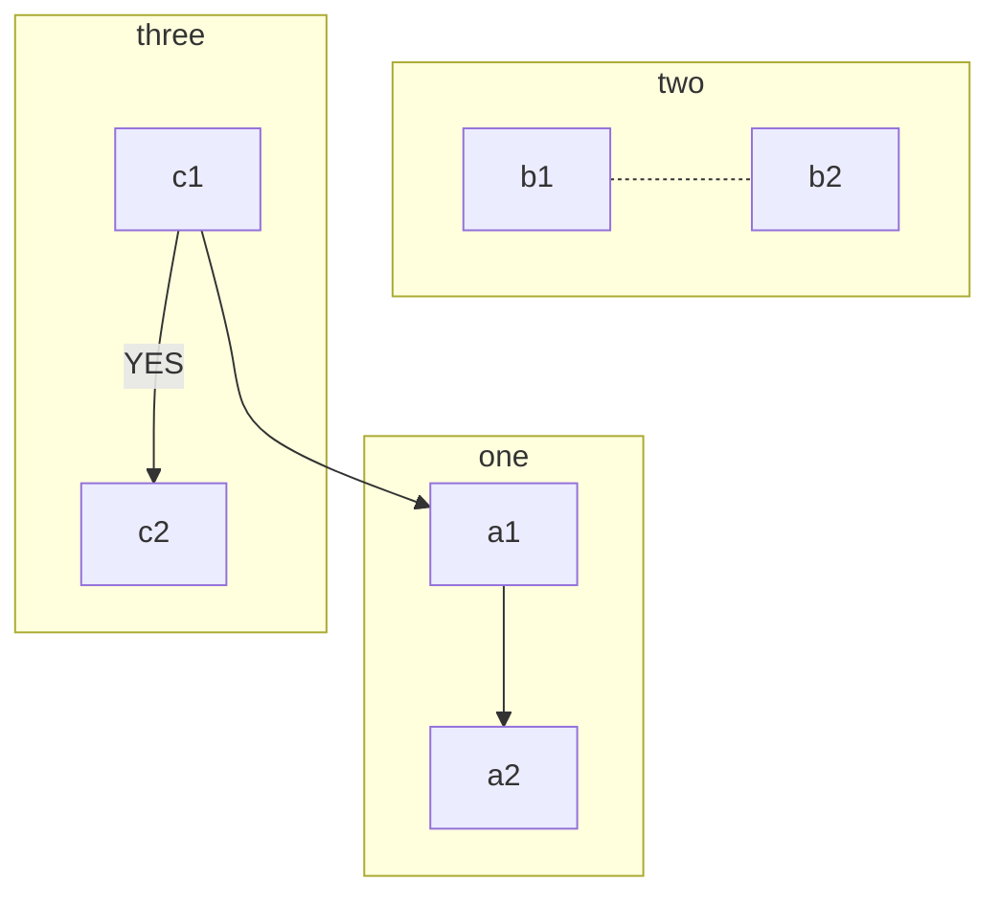
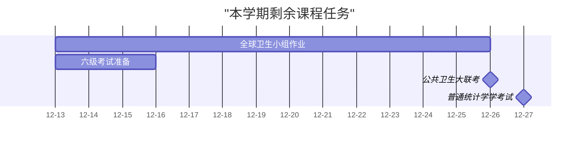
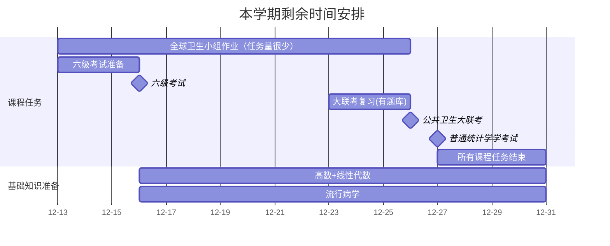

---
{"title":"Mermaid 作图学习","author":"Junwen Zhou","dg-publish":true,"permalink":"/Obsidian学习/mermaid学习/Mermaid语法/","dgPassFrontmatter":true}
---


教程来自：# Mermaid 使用教程：从入门到精通 [[internal link \| [Mermaid 使用教程：从入门到精通 - 知乎 (zhihu.com)](https://zhuanlan.zhihu.com/p/627356428)]]

代码教程：
[[[教程 \| Mermaid 中文网 (nodejs.cn)](https://mermaid.nodejs.cn/config/Tutorials.html)]]
## Mermaid可以做的图种类
1. **流程图**（Flowchart）：展示过程、决策和操作流程。
2. **序列图**（Sequence Diagram）：展示对象之间的交互顺序。
3. **甘特图**（Gantt Chart）：展示项目计划和进度。
4. **词云图**（Class Diagram）：展示类的结构和关系。
5. **饼图**（Pie Chart）：展示数据占比。
6. **捷径图**（Shortcut）：简单展示快捷方式。
7. **状态图**（State Diagram）：展示对象状态的转换。
8. **用户旅程图**（Journey）：展示用户如何与应用程序交互。

## 流程图

#### 可以修改的参数
##### 流程图的方向
- TB - 从上到下
- TD - 自上而下/与自上而下相同
- BT - 从下到上
- RL - 从右到左
- LR - 从左到右
##### 元素的形状

>[!question]
>1. 边框内的换行怎么实现？ re: 在需要换行的地方插入'\n'
>2. 一个节点可以出现在两个不同的流程图中吗？ re：可以，可以形成交叉的效果
##### 元素之间的链接形式
 ```mermaid
flowchart LR
id1(圆角边框)
id2([体育场形状\n的边框])
id3[[又是一种形状]]
id4[(圆柱形边框)]
id5((圆形边框))
id6>标签型边框]
id7{菱形边框}
id8{{六边形边框}}
id9[/平行四边形/]
id10[\另一种方向的平行四边形\]
id11[/下底比上底长的梯形\]
id12[\下底比上底短的梯形/]
id13(((双圈)))
id1-->id2-->id3 -- text! ---id4-- text! --->id5==>id6-.->id7-.text.-id8
id9==text==>id10-->id11-- text --> id12 -.-id13
```
>有一个问题：
>id1-->id2-->id3-- text! ---id4-- text! --->id5==>id6能正常显示，而
>id1-->id2---id3-- text! ---id4-- text! --->id5==>id6却不能正常显示？

链接的长度：
流程图中的每个节点最终根据其链接到的节点分配给渲染图中的一个等级，即垂直或水平级别（取决于流程图方向）。 默认情况下，链接可以跨越任意数量的等级，但你可以通过在链接定义中添加额外的破折号来要求任何链接比其他链接更长。
在以下示例中，在从节点 B 到节点 E 的链接中添加了两个额外的破折号，以便它比常规链接多跨越两个等级

##### 子图








研究生阶段：

一：课程安排

二：一些重要时间点

三：一些奖项及要求

四
