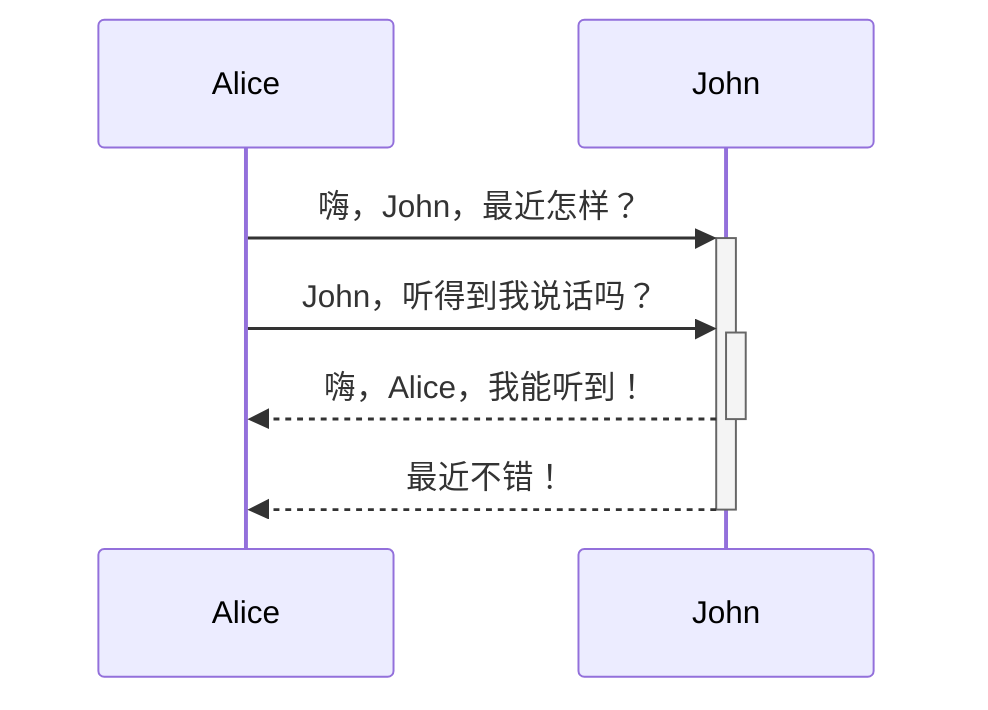

---
{"dg-publish":true,"permalink":"/Obsidian学习/obsidian学习日记/","dgPassFrontmatter":true}
---

==内部链接==非常简单，只需要输入 `[[`，并从弹出的<mark style="background: #FFB8EBA6;">列表里</mark>选择自己需要链接的文件即可。你可以通过上下方向键或输入关键词来选择文件，当所需文件被选中（高亮）时按下回车键即可完成链接。]]

练习1：[[学期课程/各种pre/妇幼pre#全国妇幼健康监测及年报通讯\|学期课程/各种pre/妇幼pre#全国妇幼健康监测及年报通讯]] 链接标题
练习2：[[学期课程/各种pre/妇幼pre#^bbad31\|学期课程/各种pre/妇幼pre#^bbad31]]  链接文本块
练习3：

#obsidian小技巧
1、图表

为什么没有图[^2]？因为之前还有三个

Here's a simple footnote,[^1] and here's a longer one.[^bignote]

[^1]: This is the first footnote.[[Obsidian学习/obsidian学习日记\|Obsidian学习/obsidian学习日记]]
[^bignote]: Here's one with multiple paragraphs and code.

    Indent paragraphs to include them in the footnote.

    `{ my code }`

    Add as many paragraphs as you like.
[^2]:这是撒谎

2023年12月2日
尝试了pandoc的导出pdf功能，大概理解了pandoc、obsidian、xelatex之间的关系。
首先，obsidian是一个markdown编辑器，负责生成markdown文件，pandoc则是一个文件转换器，通过它可以将markdown文件转为各种其他格式的文件。其中，pdf格式的文件是最常用的，pandoc在将markdown文件转为pdf文件时时需要用到编辑器，xelatex就是一个编辑器的功能。pandoc有自己的一套latex模板，xelatex根据这个模板，生成对应格式的pdf文件。
现在的问题就是：
使用pandoc插件时会有很多bug，首先，图片导不出[^3],还有就是希望能自己修改模板，调整页边距，同时做一些美化等等，还有很长的路要走

在任务管理器中输入以下命令，可得：
pandoc {相关与回归作业.md} -o test.pdf --pdf-engine=xelatex -V CJKmainfont='simsun.ttc' -N --toc
各个命令的含义：
-V CJKmainfont='simsun.ttc' ：对于中文文档，需要指定中文字体
-- toc：生成目录

但是有一个小bug：yaml怎么不显示了？

 pandoc 相关与回归作业.md -o 第七章作业.pdf --pdf-engine=xelatex -V CJKmainfont='simsun.ttc' -V mainfont='consola.ttf' -N --toc --highlight-style zenburn -H head.tex

pandoc中的一些命令合集：
[Pandoc+TeXLive实现Markdown转PDF - 知乎 (zhihu.com)](https://zhuanlan.zhihu.com/p/444440478)

[^3] 这个问题已经解决，图片的引用方式改为绝对路径就行

